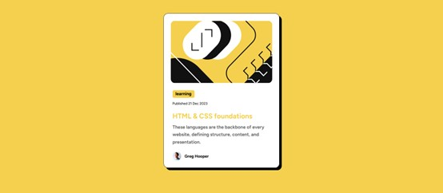
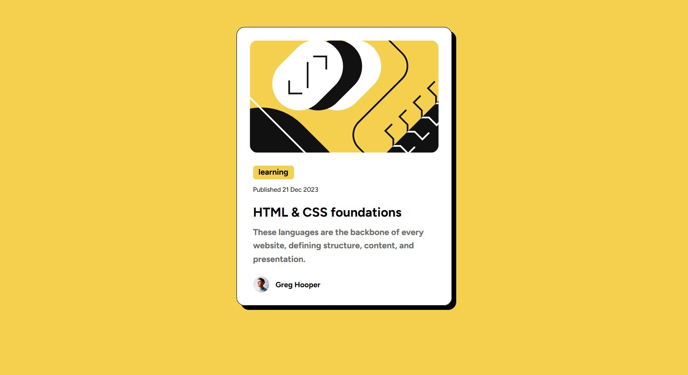
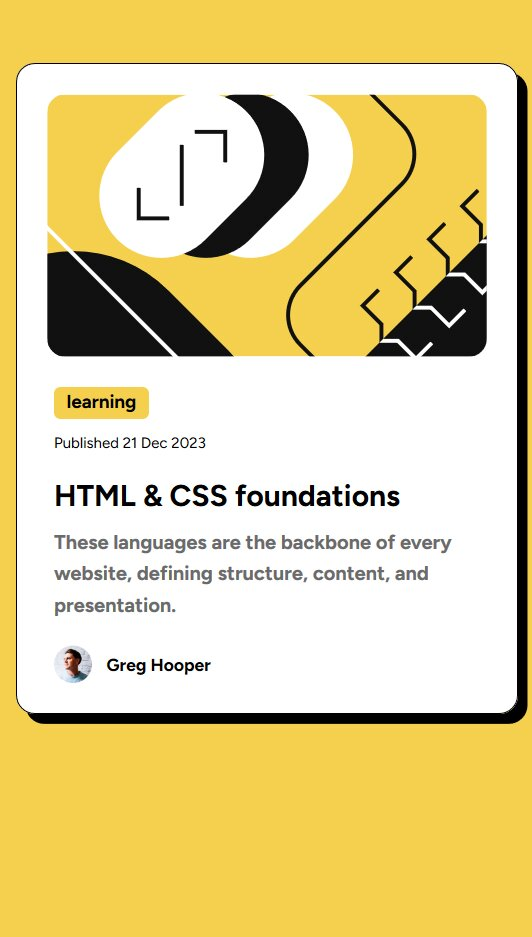

# Frontend Mentor - Blog preview card solution

This is a solution to the [Blog preview card challenge on Frontend Mentor](https://www.frontendmentor.io/challenges/blog-preview-card-ckPaj01IcS). Frontend Mentor challenges help you improve your coding skills by building realistic projects. 

## Table of contents

- [Overview](#overview)
  - [The challenge](#the-challenge)
  - [Screenshot](#screenshot)
  - [Links](#links)
  - [Built with](#built-with)
  - [What I learned](#what-i-learned)
  - [Continued development](#continued-development)
  - [Useful resources](#useful-resources)
  - [AI Collaboration](#ai-collaboration)
- [Author](#author)


**Note: Delete this note and update the table of contents based on what sections you keep.**

## Overview
At first, I thought it would be difficult and I wouldn't be able to complete it on my own, but when I started working on it, I realized how easy it is when you try to find solutions and correct mistakes yourself, and how enjoyable and satisfying it is to see the final result. It's not professional, but it's close, at least. I really love this challenge, and I will work on developing myself further and return to do it in a more professional way, God willing.

### The challenge



### Screenshot






### Links

- Solution URL: [Add solution URL here](https://github.com/Eathoo88/Blog-preview-card)

- Live Site URL: [Add live site URL here](https://eathoo88.github.io/Blog-preview-card/)


### Built with

- Semantic HTML5 markup
- CSS properties
- Flexbox

### What I learned

I learned that I should use a <span> rather than the <p> to do the logo and the name beside each other, and the benefit of  line-height is to make the sentence look neater.


```html
  
        <span id="profile-name">Greg Hooper</span>
```
```css
.p2{
   
   line-height: 25px;
   
}
```


### Continued development

I really want to learn flexbox more specifically, and learn how to make web pages work well on mobile because I'm not good at it now.


### Useful resources

- [Example resource 1](https://www.freecodecamp.org/) - This helped me learn the basics of the  HTML and CSS.
- [Example resource 2](https://www.w3schools.com/) - This is also a good website to learn a new feature or to find how to code something that you don't remember.


### AI Collaboration


- What tools did you use (e.g., ChatGPT, Claude, GitHub Copilot)? 

I used AI mode in google.

- How did you use them (e.g., debugging, generating boilerplate, brainstorming solutions)?

help me in debugging.


## Author

- Frontend Mentor - [@Eathoo88](https://www.frontendmentor.io/profile/Eathoo88)


